# Reinforcement Learning on your home computer with CURL
##### Gijs Koning (4453484) g.koning@student.tudelft.nl
##### Chiel de Vries (4571983) c.devries-1@student.tudelft.nl

## Introduction

Deep learning is an amazing new tool in the world of computer science. New techniques are developed daily and there is currently no end in sight. One problem encountered by many students in this field is the insane amount of computing power that is necessary for some models. For student that want to study the field this can be a big hurdle. 

CURL (Contrastive Unsupervised representations for Reinforcement Learning) [[1]](#1) is a model that performs representation learning for reinforcement learning (RL) agents. It can learn to do complex tasks from raw pixel data.  It promised to be more sample efficient than currently available models. This work aims to recreate the performance of the already efficient CURL model with lower compute settings, like reduced batch size and replay buffer size. This frees up a lot of memory which allows it to be run on machines that would be available for a student. 

This work replicates CURL and  compares with another unsupervised pixel-based RL model: SAC+AE. They are run on the same settings to level the playing field and provide a fair comparison. 

bit about results

## Model
This section will briefly introduce The implementation of CURL and it's components. CURL uses a contrastive representation learner that provides meaningful representations from raw pixel data. The representations are then passed to a RL model, which is Soft Actor Critic for this work.

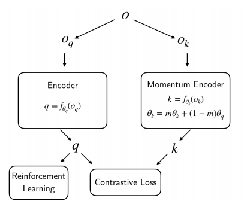  
*Figure 1: CURL encoder scheme.*

### Contrastive Learning
Contrastive learning is a form of unsupervised representation learning. It learns to distinguish between different augmentations of the same images and augmentations of other images. A schematic overview of the system can be viewed above. The way it works is as follows:

First, the observation is augmented twice, once as a query and once as a key. In this case augmentation means taking a random crop of 84 by 84 pixels (the original size is 100 by 100 pixels). Most contrastive learning algorithms use just one image as an input, but since CURL is designed for reinforcement learning it benefits from having temporal information as well. Therefore, a stack of three images is used which are simply stacked together in the same dimension as the RGB channels. Thus, creating a stack of size 9x100x100. The whole stack is cropped in the same way during augmentation. 

Second, the query and the key are encoded to latent vectors of size 50. They are encoded by two different encoders, The key-encoder being a momentum updated version of the query-encoder. This means the weights of the key-encoder are updated by an exponential moving average (EMA) of the query encoder conform equation 1. The encoder itself is a simple set of 4 32-channel convolutional layers with ReLUs followed by an MLP with one hidden layer of size 1024, with layernorm and tanh non-linearity. 

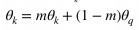  
*Equation 1: Update of the weights of the key-encoder with the EMA of the weight of the query encoder.*

Third, a similarity is calculated between the query and a set of keys. The goal is to ensure that the query is most similar to it's corresponding key, called the _positive_, and to minimise the similarity with the other keys, called the _negatives_. The negatives are the keys of the other images in the current batch. The similarity measure used is bilinear similarity. The loss function used to train the system is the InfoNCE loss [[3]](#3). It can be interpreted as the log loss of a K-way softmax classifier where the label is the positive (k+), and W is a learnable parameter.

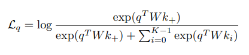  
*Equation 2: InfoNCE loss function.*

This is the basic setup of the contrastive learning CURL uses. However, it has one more ace up its sleeve. The encoder is not only updated using the contrastive loss, but also using the loss created in the connected RL agent. This enables the representations created by the encoder to be useful for the specific task the agent aims to teach itself. 

CURL is designed to be able to work with any reinforcement learning algorithm. Srinivas et al. [[1]](#1) use two algorithms in their work: SAC and Rainbow DQN. This work uses just the SAC algorithm since the performance of CURL is tested on a DMC task which needs continuous input values. The way SAC works is discussed in the next section.

### Soft Actor Critic
SAC [[2]](#2) is a model-free deep reinforcement learning algorithm. The aim of this algorithm to improve the sample efficiency and stability compared with other state-of-the-art RL frameworks. The full explanation of the workings of SAC is outside of the scope of this work, but it does aim to provide some intuition on how it works for the uninitiated. 

RL algorithms are agents. They perceive an environment and use those observations to decide what action to perform on the environment. They decide what action to use based on a reward they receive from the environment upon performing the action. The agent aims to maximize this reward over time. With Deep RL algorithms the internals of the agents are based on deep neural networks. 

SAC builds on previous actor critic methods and has two main components: The _actor_ and the _critic_. The actor learns to sample actions from the _policy_ and the critic learns to improve the policy based on the reward of the action and the current state of the environment. The policy is a function that determines the strategy of the agent. Together the actor and the critic aim to maximize the effectiveness of the policy to generate rewards by using a method called maximum entropy reinforcement learning. In CURL the gradient of the critic network is used to update the encoder during training. 

To reiterate, the description above is greatly oversimplifying the methods used in SAC. An in depth description can be found in the original paper by Haarnoja et al. [[2]](#2)

## Experimental Setup
This section briefly discusses the experiments  performed experiments. It explains the framework on which the algorithm is evaluated, which settings are tested and to which other model CURL is compared. 

### Deepmind Control Suite
All models are tested in the DMC suite [[4]](#4). This is a set of continous control tasks designed to test reinforcement learning models. Srinivas et al. [[1]](#1) evaluated CURL on 16 of these tasks. Because of time restrictions, this work only uses the cartpole swingup task. In this task the agent needs to swing a pole upwards and try to balance it as good as possible. It has to do this by moving the cart to the left and to the right.

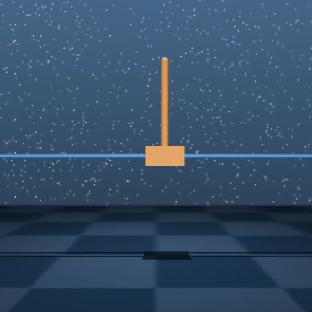  
*Figure 2: A frame of the cartpole swingup task with the pole nicely balanced* at the top.

### Training Settings
The replicated CURL model is evaluated with various setting. The original paper on CURL used a batch size of 512. This used too much video memory to be able to be run on the machines used for this work. Therefore a batch size of 256 was chosen. Another setting that needed to be toned down (for one of the machines at least) is the replay buffer size. The original paper used a replay buffer of 100k images, but we tested 50k and 5k as well. All other settings were set to the default values also used by Srinivas et al. [[1]](#1). Only a single run of 500k environment steps for each experiment is done because of time constraints.

### Comparison 
Other than testing the performance of CURL with various replay buffer sizes, it is also compared to another state-of-the-art RL model named SAC+AE (Soft Actor Critic + AutoEncoder) [[5]](#5). It uses the same SAC algorithm as CURL, but instead of using a contrastive model for representation learning, it uses an autoencoder scheme. SAC+AE is tested with the same settings as CURL to provide a fair comparison. 

<!---
To reproduce the results of the CURL paper we choose to use the Cartpole swingup problem executed in the Deep Mind Control suite environment. Which is one problems used in the paper.
Because of computation constraints on our personal laptops we changed batch size and replay buffer parameters. Since a batch size of 512 for images of size 84 by 84 required a video memory size not available to us we used a batch size of 256 for all experiments. A replay buffer of more than 50k steps was not available on one of our machines but we could experiment with both 50k and 100k steps.\
Only a single run for each experiment is done because of time constraints.
-->

## Results
The results of the aforementioned experiments are viewed in this section. 

### CURL vs SAC+AE 

The reward function over time of the the training of all models can be viewed in figure 3. From the CURL plots it is clear that a replay buffer size of 5k is less effective than one of 50k or 100k. between 50k and 100k there is no clear difference, suggesting they are equally good. With SAC+AE the result are unexpected. A replay buffer size of 5k seems to outperform 50k. The difference between 5k and 100k is less pronounced,but seems to be in the favor of 5k. The assumption is that this is an anomaly and that the training just got lucky. However, further research is necessary to confirm whether or not this is true.

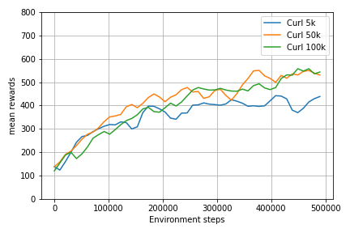
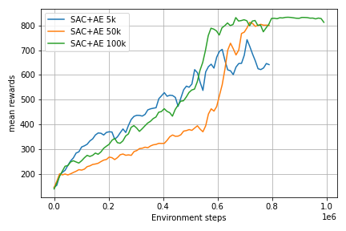  
*Figure 3: CURL and SAC+AE training curves with batch size 256 and replay buffer sizes 5k, 50k and 100k. The plot shows the moving average over the last 20k environment steps.*

When comparing CURL to SAC+AE it is clear that CURL achieves higher scores in the early stages of the training. This confirms the findings of the authors that CURL is more sample efficient because it converges earlier. However, the best SAC+AE model ends at a similar score as the best CURL model. Therefore, there is no certainty that a longer training could have one outperforming the other in the long run. 

### Batch Size Comparison
The performances of CURL and SAC+AE with batch size 256 are also compared with the original paper, where they used a batch size of 512. Table 1 shows the results of this comparison. It is clear that a batch size of 512 performs better than 256, as is to be expected. 

<table>
<thead>
  <tr>
    <th>Replay Buffer Size</th>
    <th>CURL 512</th>
    <th>CURL 256</th>
    <th>SAC+AE 512</th>
    <th>SAC+AE 256</th>
  </tr>
</thead>
<tbody>
  <tr>
    <td>100k</td>
    <td>841 ± 45</td>
    <td>526</td>
    <td>735 ± 63</td>
    <td>533</td>
  </tr>
  <tr>
    <td>50k</td>
    <td>-</td>
    <td>494</td>
    <td>-</td>
    <td>378</td>
  </tr>
  <tr>
    <td>5k</td>
    <td>-</td>
    <td>430</td>
    <td>-</td>
    <td>545</td>
  </tr>
</tbody>
</table>  
*Table 1: Comparison of CURL and SAC+AE with batch size 256 and 512. The columns with batch size 512 contain the means and standard deviation over 10 runs. The columns with batch size 512 contain the average of the last 20k environment steps.*

We compare the CURL performance on the Cartpole problem with one of the baselines used in the paper, the SAC+AE method and according to the paper CURL shousld outperform SAC+AE for 100k and 500 environment step scores. However, since our personal computers did not have the video memory size that is needed for the big batch size used in CURL we can expect different results than in the paper.\
Figure 2 shows that based on our results CURL outperforms SAC+AE after 100k environments steps, but the difference is negligible after 500k steps. Next to that when training further than 500.000 steps SAC+AE outperforms CURL, as can be seen clearly in Figure 2.\ 
The reason that CURL is outperformed could be because CURL does not use a batch size of 512 in our experiments. Compared to the paper, our results are lower with only a score of ~300 and ~520 for 100k and 500k steps respectively while the paper shows that CURL can achieve 582 and 841.
Our results of SAC+AE seem to be just below the performance (~550 for 500k environment steps) compared to their paper (~750 reward after 500k environment steps). This could be explained by the smaller replay buffer of 1e5 instead of 1e6 or that we use a bigger batch size of 256.  
\
*Figure 2: Comparison between CURL and SAC+AE where in general CURL outperforms SAC+AE.*\
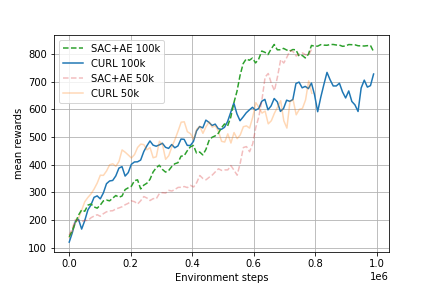\
*Figure 3: Same comparison between CURL and SAC+AE as in previous figure but with environment steps until 1e6.*

We also compare the performance of CURL using different replay buffer sizes of 5,50 and 100k in Figure [4](#compare_replay_size), where 100k is the default used in the paper.  
\
*Figure 4: Comparison of CURL with different replay buffer sizes.*

\
*Figure 5: Comparison of SAC+AE with different replay buffer sizes.*

### Visualizing the encoder
The encoder converts the image input into a smaller latent space. We can visualize the featuremaps of one of the convolutional layers to see what the encoder is focussing on.\
This observation image is given to the encoder model:\
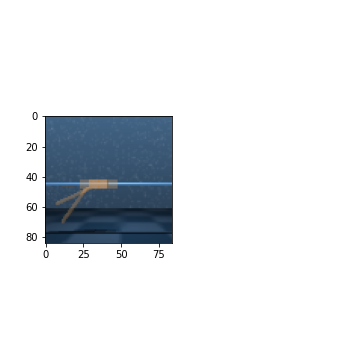\
and creates these 32 featuremaps after the first convolutional layer with Relu activation:\
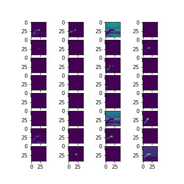.\
Some things can be noticed: Featuremaps analyze different timesteps, for example 1 and 2 analyze a different timestep as can be seen from the angle of the cartpole stick. 
Second, a lot of featuremaps are not active at all. We are not sure why this is the case, it could be that 32 featuremaps are overkill for the first convolutional layer for this environment.
For other observation inputs we see the same set of featuremaps activated as well.

### Freezing the encoder
We also analyzed freezing the encoder after 400k timesteps to see the increase in computational efficiency during training, since the encoder update is a big part of the whole training process.
In Figure 7 we can see that the encoder loss when training CURL with a replay buffer of 100k. The loss is already quite low and seems to be converging around 400 to 500k timesteps of training. 
Restarting the training at timestep 400k and freezing the encoder let to Figures 8,9. We are unsure how it is possible that the total performance improved over not freezing the encoder. We think it could be because the freezed encoder produces a more consistent output but it can also be a random coincidence.
The figure visualizing the training based on training minutes shows clearly that excluding the encoder update speeds up the training process significantly. The last 400k training steps where 2.25 times faster to train with the freezed encoder.

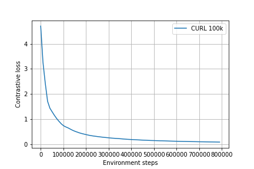\
*Figure 7: Contrastive loss of the encoder during training of CURL with 100k replay buffer*\
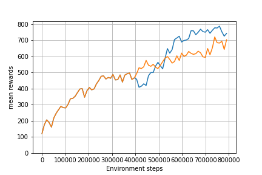 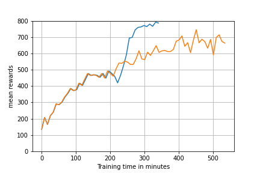\
*Figure 8: Encoder freezed at timestep 400k.*       *Figure 9: Encoder freezed at timestep 400k with x axis visualized in training time in minutes.*

## Conclusion and Discussion

## References
<a id="1">[1]</a> 
Srinivas, A., Laskin, M., & Abbeel, P. (2020). CURL: Contrastive Unsupervised Representations for Reinforcement Learning. ICML.

<a id="2">[2]</a> 
Haarnoja, T., Zhou, A., Abbeel, P., & Levine, S. (2018). Soft Actor-Critic: Off-Policy Maximum Entropy Deep Reinforcement Learning with a Stochastic Actor. ICML.

<a id="3">[3]</a> 
Oord, A.V., Li, Y., & Vinyals, O. (2018). Representation Learning with Contrastive Predictive Coding. ArXiv, abs/1807.03748.

<a id="4">[4]</a> 
Tassa, Y., Doron, Y., Muldal, A., Erez, T., Li, Y., Casas, D. D. L., ... & Riedmiller, M. (2018). Deepmind control suite. arXiv preprint arXiv:1801.00690.

<a id="5">[5]</a> 
Yarats, D., Zhang, A., Kostrikov, I., Amos, B., Pineau, J., & Fergus, R. (2019). Improving sample efficiency in model-free reinforcement learning from images. arXiv preprint arXiv:1910.01741.

