# Reinforcement Learning on your home computer with CURL
##### Gijs Koning (4453484) g.koning@student.tudelft.nl
##### Chiel de Vries (4571983) c.devries-1@student.tudelft.nl

## Introduction

Deep learning is an amazing new field in the world of computer science. New techniques are developed daily and there is currently no end in sight. A problem encountered by many students in this field is the insane amount of computing power that is necessary for some models. For student that want to study the field this can be a big hurdle. 

Reinforcement learing (RL) is a subfield of machine learning that trains agents. Agents perceive an environment and use those observations to decide what action to perform on the environment. They decide what action to use based on a reward they receive from the environment upon performing the action. The agent aims to maximize this reward over time. With Deep RL algorithms the internals of the agents are based on deep neural networks. 

RL agents are a crucial part of autonomous robotics for learning to perform tasks like grabbing objects or not hitting walls when moving. Ideally the agent would have perfect information of its environment, but often this is not the case. The information an agent gets is dependent on the sensors it has to perceive it. Many RL models struggle when learning from raw pixel data for instance, Therefore, it is of utmost importance that an RL agent learns good representations of this visual data such that it can learn task more effieciently. 

CURL (Contrastive Unsupervised representations for Reinforcement Learning) [[1]](#1) is a model that performs representation learning for reinforcement learning agents. It can learn to do complex tasks from raw pixel data.  It promised to be more sample efficient than currently available models. This work aims to recreate the performance of the already efficient CURL model with lower compute settings, like reduced batch size and replay buffer size. This releases a lot of memory which allows it to be run on machines that would be available for a student. 

This work reimplements CURL and uses it to reproduce the sample efficient results of the original paper, but on lower settings. The aim is to see whether CURL stays more sample efficient, even on those lower settings. To do that it is compared to another unsupervised pixel-based RL model: SAC+AE. 

## Model
This section will briefly introduce the implementation of CURL and it's components. CURL uses a contrastive representation learner that provides meaningful representations from raw pixel data. The representations are then passed to a RL model, which is Soft Actor Critic [[2]](#2) for this work.

  
*Figure 1: CURL encoder scheme.*

### Contrastive Learning
Contrastive learning is a form of unsupervised representation learning. It learns to distinguish between different augmentations of the same images and augmentations of other images. A schematic overview of the system can be viewed above. 

First, the observation is augmented twice, once as a query and once as a key. In this case augmentation means taking a random crop of 84 by 84 pixels (the original size is 100 by 100 pixels). Other contrastive learning schemes can use differnt augmentations as well, like rotations. CURL does not do this since a clear sense of up and down is often necessary for an RL task. Most contrastive learning algorithms use just one image as an input, but since CURL is designed for reinforcement learning it benefits from having temporal information as well. Therefore, a stack of three images is used which are simply stacked together in the same dimension as the RGB channels. Thus, creating a stack of size 9x100x100. The whole stack is cropped in the same way during augmentation. 

Second, the query and the key are encoded to latent vectors of size 50. The authors give no reason for coosing this size. the Query and key are encoded using the query- and key-encoder respectively. The key-encoder is a momentum updated version of the query-encoder. This means the weights of the key-encoder are updated by an exponential moving average (EMA) of the query encoder conform equation 1. The encoder itself is a simple set of 4 32-channel convolutional layers with ReLUs followed by an MLP with one hidden layer of size 1024, with layernorm and tanh non-linearity. 

\
*Equation 1: Update of the weights of the key-encoder with the EMA of the weight of the query encoder.*

Third, a similarity is calculated between the query and a set of keys. The goal is to ensure that the query is most similar to it's corresponding key, called the _positive_, and to minimise the similarity with the other keys, called the _negatives_. The negatives are the keys of the other images in the current batch. The similarity measure used is bilinear similarity. Bilinear similarity can learn which parts of the representation are more (or less) important for the algorithm, making it more meaningful than a simple dot product. The loss function used to train the system is the InfoNCE loss [[3]](#3). It can be interpreted as the log loss of a K-way softmax classifier where the label is the positive (k+), and W is a learnable parameter for bilinear similarity.

  
*Equation 2: InfoNCE loss function.*

This is the basic setup of the contrastive learning CURL uses. However, it has one more ace up its sleeve. The encoder is not only updated using the contrastive loss, but also using the loss created in the connected RL agent. This enables the representations created by the encoder to be useful for the specific task the agent aims to teach itself. 

CURL is designed to be able to work with any reinforcement learning algorithm. Srinivas et al. [[1]](#1) use two algorithms in their work: SAC and Rainbow DQN. This work uses just the SAC algorithm since the performance of CURL is tested on a DMC task which needs continuous input values which SAC is designed for.

### Soft Actor Critic
SAC [[2]](#2) is a model-free deep reinforcement learning algorithm. The aim of this algorithm to improve the sample efficiency and stability compared with other state-of-the-art RL frameworks. The full explanation of the workings of SAC is outside of the scope of this work, but it does aim to provide some intuition on how it works for the uninitiated. 

SAC builds on previous actor critic methods and has two main components: the _actor_ and the _critic_. The actor learns to sample actions from the _policy_ and the critic learns to improve the policy based on the reward of the action and the current state of the environment. The policy is a function that determines the strategy of the agent. Together the actor and the critic aim to maximize the effectiveness of the policy to generate rewards by using a method called maximum entropy reinforcement learning. In CURL the gradient of the critic network is used to update the encoder during training. 

To reiterate, the description above is greatly oversimplifying the methods used in SAC. An in depth description can be found in the original paper by Haarnoja et al. [[2]](#2)

## Experimental Setup
This section introduces the experiments that are performed. It explains the framework on which the algorithm is evaluated, which settings are tested and to which other model CURL is compared. 

### Deepmind Control Suite
All models are tested in the DMC suite [[4]](#4). This is a set of continous control tasks designed to test reinforcement learning models. Srinivas et al. [[1]](#1) evaluated CURL on 16 of these tasks. Because of time restrictions, this work only uses the cartpole swingup task. In this task the agent needs to swing a pole upwards and try to balance it as good as possible. It has to do this by moving the cart to the left and to the right.

\
*Figure 2: A frame of the cartpole swingup task with the pole nicely balanced* at the top.

### Training Settings
The replicated CURL model is evaluated with various setting. The original paper on CURL used a batch size of 512. This used too much video memory to be able to be run on the machines used for this work. Therefore a batch size of 256 was chosen. Another setting that needed to be toned down (for one of the machines at least) is the replay buffer size. The original paper used a replay buffer of 100k images, but we tested 50k and 5k as well. All other settings were set to the default values also used by Srinivas et al. [[1]](#1). 
As a base rule, only a single run of 500k environment steps for each experiment is done because of time constraints, but some are run longer to check whether the training would improve later on.

The final experiment is about freezing the encoder at a point where it seems to have converged. Freeing the encoder means that it is not trained any further. However, the RL model is trained further to evaluate the impact of freezing the encoder.

### Comparison 
Other than testing the performance of CURL with various replay buffer sizes, it is also compared to another state-of-the-art RL model named SAC+AE (Soft Actor Critic + AutoEncoder) [[5]](#5). It uses the same SAC algorithm as CURL, but instead of using a contrastive model for representation learning, it uses an autoencoder scheme. This autoencoder has a latent space of the same size as the contrastive learning model in CURL and it is trained by reconstructing the input from the latent space using a simple reconstructive loss (MSE). The encoder of SAC+AE has the same architecture as the encoder of CURL and the decoder is the same, but in reverse order. Therefore, both models have (roughly) the same amount of parameters. SAC+AE is tested with the same batch size and replay buffers as CURL. Combined with the similar amount of parameters this should be a fair comparison. 

## Results
The results of the aforementioned experiments are viewed in this section. 

### CURL vs SAC+AE 

The reward function over time of the the training of all models can be viewed in figure 3. From the CURL plots it is clear that a replay buffer size of 5k is less effective than one of 50k or 100k. Between 50k and 100k there is no clear difference, suggesting they are equally good. With SAC+AE the result are unexpected. A replay buffer size of 5k seems to outperform 50k. The difference between 5k and 100k is less pronounced, but seems to be in the favour of 5k. The assumption is that this is an anomaly and that the training just got lucky. Repeating runs multiple times can provide a statistical basis to  show whether or not this is true.

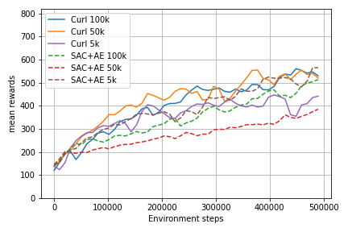
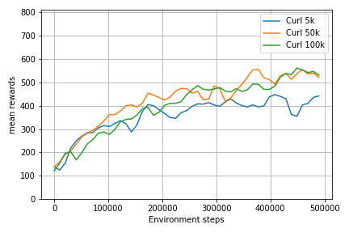
\
*Figure 3: CURL and SAC+AE training curves with batch size 256 and replay buffer sizes 5k, 50k and 100k. The plots show the moving average over the last 20k environment steps. The right plot is a combination of the middle and left plots*

When comparing CURL to SAC+AE it is clear that CURL achieves higher scores in the early stages of the training. This confirms the findings of the authors that CURL is more sample efficient because it converges earlier. However, the best SAC+AE model ends at a similar score as the best CURL model. However, it looks like SAC+AE is not nearing convergence. This could imply that training longer may prove fruitful for SAC+AE.

To check this, some of the runs were trained for a longer time. The result of this can be found in figure 4. Not only did the SAC+AE not converge, it seems to have a spike in the reward just after the 500k environment steps. This increase in reward is visible in the results of Yarats et al. as well, but only for this specific task (cartpole swingup). It is unclear where this sudden spike originates from. 
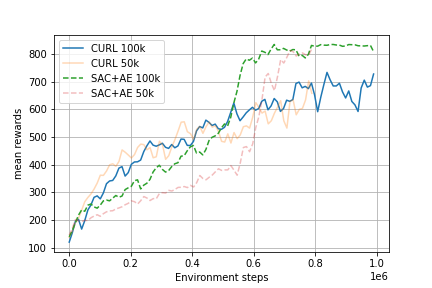\
*Figure 4: Training curves for 800k-1M environment steps.*

### Batch Size Comparison
The performances of CURL and SAC+AE with batch size 256 are also compared with the original paper, where they used a batch size of 512. Table 1 shows the results of this comparison. The values in the table are averages over the last 20k environment steps after 500k steps (the average over 480k-500k). It is clear that a batch size of 512 performs better than 256, as is to be expected. 

<table>
<thead>
  <tr>
    <th>Replay Buffer Size</th>
    <th>CURL 512</th> 
    <th>CURL 256</th>
    <th>SAC+AE 512</th>
    <th>SAC+AE 256</th>
  </tr>
</thead>
<tbody>
  <tr>
    <td>100k</td>
    <td>841 ± 45</td>
    <td>526</td>
    <td>735 ± 63</td>
    <td>533</td>
  </tr>
  <tr>
    <td>50k</td>
    <td>-</td>
    <td>494</td>
    <td>-</td>
    <td>378</td>
  </tr>
  <tr>
    <td>5k</td>
    <td>-</td>
    <td>430</td>
    <td>-</td>
    <td>545</td>
  </tr>
</tbody>
</table>  
*Table 1: Comparison of CURL and SAC+AE with batch size 256 and 512. The columns with batch size 512 contain the means and standard deviation over 10 runs. The columns with batch size 256 contain the average of the last 20k environment steps. *

The big outlier in table 1 is the result for SAC+AE with a replay buffer size of 5k. More runs should be done with these settings to test whether this is indeed an outlier or if it is actually performing better than 100k or 50k. 

### Visualizing the encoder

The encoder converts the image input into a smaller latent space. We can visualize the featuremaps of one of the convolutional layers to see what the encoder is focussing on.\
A observation is given to the encoder model, the stack of its three images is visualized below and creates these 32 featuremaps after the first convolutional layer with Relu activation:\
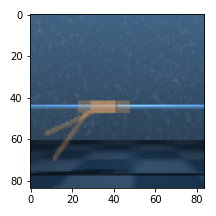 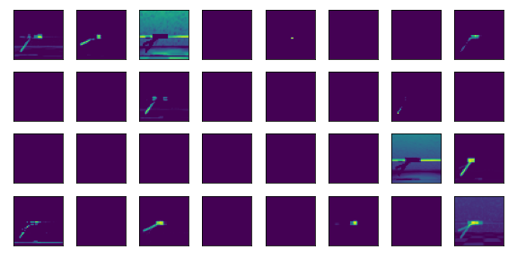\
Some things can be noticed: Featuremaps analyze different timesteps, for example 1 and 2 analyze a different timestep as can be seen from the angle of the cartpole stick. 
Second, a lot of featuremaps are not active at all. We are not sure why this is the case, it could be that 32 featuremaps are overkill for the first convolutional layer for this environment.
For other observation inputs we can see the same set of featuremaps activated.\
The other observations of the same environment and  observations with featuremaps from a trained encoder created using the Walker environment can be seen in the appendix.

### Freezing the encoder
We also analyzed freezing the encoder after 400k timesteps to see the increase in computational efficiency during training, since the encoder update is a big part of the whole training process.
In Figure 7 we can see that the encoder loss when training CURL with a replay buffer of 100k. The loss is already quite low and seems to be converging around 400 to 500k timesteps of training. 
Restarting the training at timestep 400k and freezing the encoder let to Figure 8. We are unsure how it is possible that the total performance improved over not freezing the encoder. We think it could be because the freezed encoder produces a more consistent output but it can also be a random coincidence.
The figure visualizing the training based on training minutes shows clearly that excluding the encoder update speeds up the training process significantly. The last 400k training steps where 2.25 times faster to train with the freezed encoder.\
\
*Figure 7: Contrastive loss of the encoder during training of CURL with 100k replay buffer*\
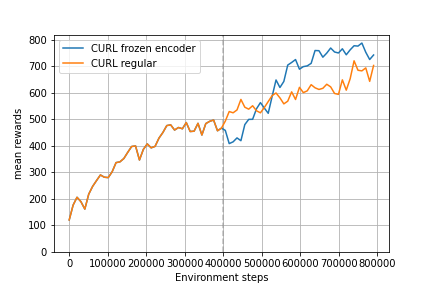 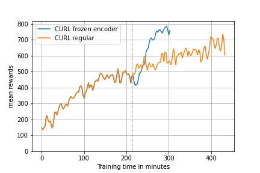\
*Figure 8: (left) Encoder frozen at timestep 400k. (right) Encoder frozen at timestep 400k with x axis visualized in training time in minutes.*
## Conclusion
We experimented with the CURL and baseline algorithm SAC+AE and compared the performances on the DCS Cartpole environment. The full batch size of 512 could not be used but we could show the difference with the lower batch size of 256.\
CURL and the SAC+AE actually produced very similar results for the first 500k timesteps. The reason that the paper performs better than that we showed can be explained by the difference in batch size.\
Next to the testing the sample efficiency we compared the algorithms with different replay buffer sizes and showed that CURL performs better with a bigger replay buffer.\
At last we analyzed the encoder by visualizing the featuremaps and found that freezing the encoder when the contrastive loss is low improved the training time and maintain the same performance.

## References
<a id="1">[1]</a> 
Srinivas, A., Laskin, M., & Abbeel, P. (2020). CURL: Contrastive Unsupervised Representations for Reinforcement Learning. ICML.

<a id="2">[2]</a> 
Haarnoja, T., Zhou, A., Abbeel, P., & Levine, S. (2018). Soft Actor-Critic: Off-Policy Maximum Entropy Deep Reinforcement Learning with a Stochastic Actor. ICML.

<a id="3">[3]</a> 
Oord, A.V., Li, Y., & Vinyals, O. (2018). Representation Learning with Contrastive Predictive Coding. ArXiv, abs/1807.03748.

<a id="4">[4]</a> 
Tassa, Y., Doron, Y., Muldal, A., Erez, T., Li, Y., Casas, D. D. L., ... & Riedmiller, M. (2018). Deepmind control suite. arXiv preprint arXiv:1801.00690.

<a id="5">[5]</a> 
Yarats, D., Zhang, A., Kostrikov, I., Amos, B., Pineau, J., & Fergus, R. (2019). Improving sample efficiency in model-free reinforcement learning from images. arXiv preprint arXiv:1910.01741.

## Appendix

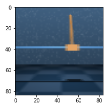
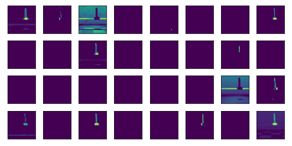\
*Appendix Figure 1: (left) Second observation input of the Cartpole environment. (right) Featuremap output of the encoder.*
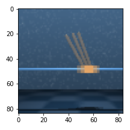
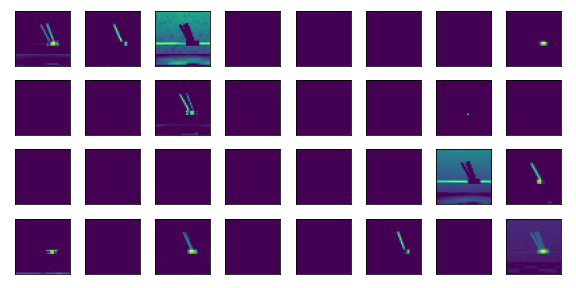\
*Appendix Figure 2: (left) Third observation input of the Cartpole environment. (right) Featuremap output of the encoder.*
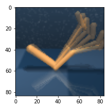
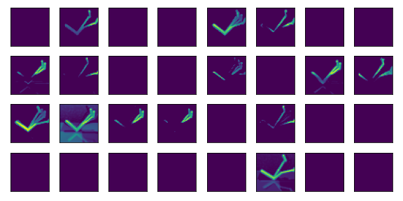\
*Appendix Figure 1: (left) First observation input of the Walker environment. (right) Featuremap output of the encoder.*
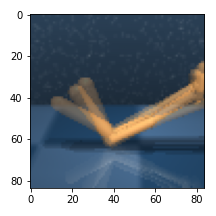
\
*Appendix Figure 2: (left) Second observation input of the Walker environment. (right) Featuremap output of the encoder.*
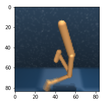
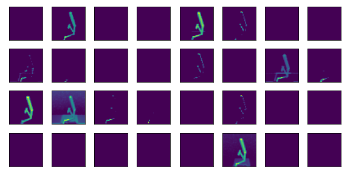\
*Appendix Figure 3: (left) Third observation input of the Walker environment. (right) Featuremap output of the encoder.*
